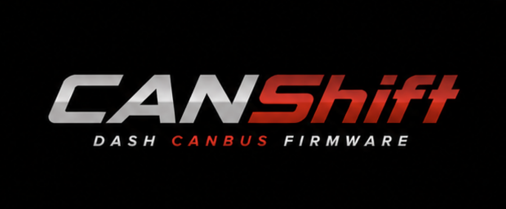

# Automotive CANbus Dashboard Workspace
<p align="center">
  
</p>

Multi-project workspace for a configurable real-time automotive dashboard system.
Built around a VW VR6 2.9 engine, MaxxECU Street ECU, and Elecrow CrowPanel 2.8" ESP32 display.

---

## Workspace Architecture

```
dashboard_canBus/
├── canshift-firmware/   # ESP32 embedded dashboard firmware (PlatformIO / C++ / LVGL)
├── canshift-studio/     # Desktop configuration editor (Electron + React + TypeScript)
├── canshift-mobile/     # iPhone companion app — PLANNED, NOT BUILT YET
├── canshift-core/       # Shared JSON schemas, TypeScript types, validation, versioning
└── docs/                # Architecture docs, roadmap, CAN notes, config contract
```

Each folder is designed to become its own independent Git repository with minimal refactoring.

---

## Phase Status

| Project                  | Phase 1 Status      | Notes                                  |
|--------------------------|---------------------|----------------------------------------|
| `canshift-firmware`          | Active — build now  | Core firmware architecture scaffolded |
| `canshift-studio`  | Active — build now  | Desktop editor foundation scaffolded  |
| `canshift-core`            | Active — build now  | Schemas and types scaffolded           |
| `canshift-mobile`   | Not started         | Documentation + planning only          |
| `docs/`                  | Active              | Architecture docs included             |

**Phase 1 is USB-first.**
The firmware and desktop app communicate over USB.
Wi-Fi and Bluetooth are planned for a later phase.
The iPhone app is not being built now.

---

## Active Projects (Phase 1)

### `canshift-firmware/`
ESP32 embedded firmware. Runs on the Elecrow CrowPanel 2.8".
- LVGL 8.3 UI
- CAN bus data ingestion via TWAI + Adafruit CAN Pal (TJA1051T/3)
- Data-driven pages and widgets, loaded from JSON config on SD/SPIFFS
- Simulation mode for UI development without live ECU
- USB communication stub for config sync with desktop app

### `canshift-studio/`
Electron + React + TypeScript desktop application.
- Visual dashboard layout editor (pages, widgets, positions, styles)
- Signal binding editor
- Theme editor
- JSON import/export
- USB communication layer to flash/sync config to the ESP32
- Preview/simulation mode

### `canshift-core/`
TypeScript-first shared domain logic.
- JSON schemas for all config entities (dashboard, page, widget, signal, theme, asset)
- Shared TypeScript types and interfaces
- Configuration validation
- Schema versioning and migration utilities
- Used by `canshift-studio` and eventually `canshift-mobile`

---

## Planned Project (Phase 2+)

### `canshift-mobile/`
React Native iOS application.
- **NOT being built now**
- Wi-Fi / BLE configuration connection to the dash
- Profile selection, quick settings, basic diagnostics
- Will reuse types and schemas from `canshift-core`
- See `canshift-mobile/README.md` for the full planning document

---

## How Projects Interact

```
MaxxECU → CAN Bus → [canshift-firmware ESP32] ← USB ← [canshift-studio]
                          |                              |
                     reads config JSON            reads/writes config JSON
                          |                              |
                    [canshift-core schemas]         [canshift-core types]

                    (future Phase 2)
                    [canshift-mobile] → Wi-Fi/BLE → [canshift-firmware ESP32]
```

- The firmware is **autonomous**: it runs without the desktop or mobile app connected.
- The desktop app edits a JSON config and sends it to the device over USB.
- `canshift-core` is the contract layer — it defines what a valid config looks like.

---

## Splitting Into Separate Git Repositories

Each folder is designed for clean repo separation:

1. **No cross-folder imports.** Each project only references `canshift-core` via its published package (npm) or a local path install during development.
2. **Independent manifests.** Each folder has its own `package.json` / `platformio.ini` / `CMakeLists.txt` as applicable.
3. **Independent CI ready.** Each project can have its own `.github/` or `.gitlab-ci.yml`.
4. **No shared build output.** No cross-project build artifacts.

**Steps to split a folder into its own repo:**
```bash
# Example: splitting canshift-firmware
cd /path/to/workspace
git subtree split --prefix=canshift-firmware -b split/canshift-firmware
# Then push to a new remote repo
```

Or simply `cp -r canshift-firmware /path/to/new-repo` and `git init`.

---

## Toolchain Summary

| Tool          | Purpose                                |
|---------------|----------------------------------------|
| PlatformIO    | ESP32 firmware build/flash             |
| C++ / Arduino | Embedded firmware language             |
| LVGL 8.3      | Embedded UI framework                  |
| Electron      | Desktop app shell                      |
| React 18      | Desktop app UI                         |
| TypeScript    | Desktop, canshift-core, mobile           |
| JSON Schema   | Config validation contracts            |
| ArduinoJson   | JSON parsing on ESP32                  |

---

## Resume Work From Here

1. Open `canshift-firmware/` in PlatformIO — verify board, compile, flash
2. Open `canshift-studio/` — `npm install && npm run dev`
3. Verify `canshift-core` builds: `cd canshift-core && npm install && npm run build`
4. Read `docs/overall-architecture.md` for full system context
5. Read `docs/roadmap.md` for phase breakdown

---

## Key Assumptions

- ECU: MaxxECU Street — CAN protocol v1.2/v1.3 assumed (verify with MaxxECU CAN output settings)
- Display: Elecrow CrowPanel 2.8" — ILI9341 + XPT2046 assumed (verify pinout before first flash)
- CAN transceiver: Adafruit CAN Pal (TJA1051T/3) — 5V tolerant, 500kbps default
- Config storage: SPIFFS on ESP32 (SD card support planned)
- Phase 1: USB serial for config sync, not OTA

See `canshift-firmware/include/board_config.h` for all hardware pin assumptions.
