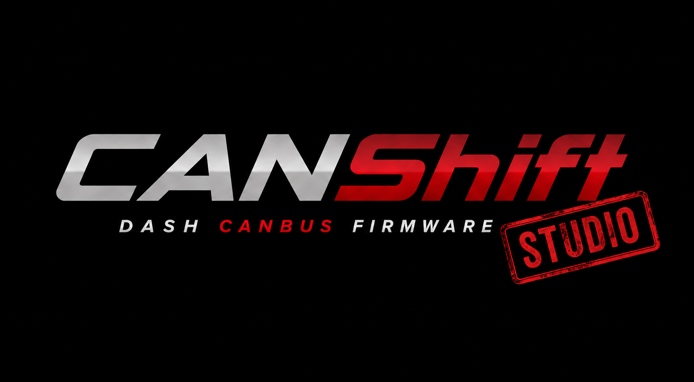

# CANShift Studio

<p align="center">
  
</p>

Desktop configuration and management application for the CANShift dashboard.
Visual layout editor, signal mapper, CAN bus scanner, and in-renderer firmware
flasher — all over a single USB serial cable. See the
[monorepo root](../README.md) for the full system overview.

---

## What it does

| Feature | Status |
|---------|--------|
| Visual dashboard editor (pages, widgets, layout, styles) | Working |
| Signal binding editor + signals export | Working |
| USB device connection (list ports, connect, disconnect) | Working |
| Push config to device with diff preview + adaptive ack timeout | Working |
| Read live `dashboard.json` from device SD card | Working |
| Session restore (reopens last file + last port on launch) | Working |
| First-run onboarding (welcome → connect → optional demo burn) | Working |
| CAN bus scanner (live frame table with fps + per-id rate) | Working |
| CAN health indicator in status bar | Working |
| Live telemetry display (LIVE / SIM / NO DATA badge) | Working |
| Structured device-log viewer (level/tag/message) | Working |
| SD-card preparation: prepare a removable card or push assets over USB | Working |
| SD-state surface (`ok` / `no_card` / `mount_failed` / `unknown`) | Working |
| Flash Latest (fetch from GitHub + flash via Web Serial in renderer) | Working |
| Manual firmware flash from local merged `.bin` | Working |
| Day/night and touch-calibration commands | Working |
| Screen settings (brightness, contrast, sleep, day/night) | Working |
| Studio auto-update (electron-updater) | Working |
| Simulation mode (no hardware required) | Working |

---

## Screenshots

<!-- TODO: add screenshots -->

---

## Stack & supported platforms

- **Electron 39.8.5** + **React 18.3** + **TypeScript 5.5**
- **Vite 7** via **electron-vite 5** (renderer build), **Vitest 4** (tests)
- **`esptool-js` 0.6.0** for Web Serial flashing — no Python `esptool` install
- **Zustand 5** for renderer state; `@tmbk/canshift-core` for shared types
- **`serialport` 12** for the main-process USB transport
- Platforms: macOS (x64 + arm64 DMGs), Windows (NSIS installer, x64),
  Linux (AppImage, x64). App id `ch.tmbk.canshift.studio`.

---

## Getting started

### Prerequisites

- Node.js 20 or newer
- `canshift-core` built once before the first run:
  ```bash
  cd canshift-core && npm install && npm run build
  ```
  Rebuild it whenever its types change (notably the IPC return types
  deduped into core in #292) — Studio reads them at compile time.

### Install and run

```bash
cd canshift-studio
npm install
npm run dev          # electron-vite dev with hot reload
npm run build        # Production build into dist/
npm run dist         # Build + electron-builder package
```

### Other scripts

```bash
npm run test         # Vitest run (one-shot)
npm run test:watch   # Vitest watch mode
npm run test:coverage
```

---

## Pre-commit checks

Run from `canshift-studio/` before every commit. Each must exit zero:

```bash
npm run lint          # ESLint + a guard against unsafe HTML sinks (#240)
npm run format:check  # Prettier
npm run typecheck     # tsc --noEmit on tsconfig.json + tsconfig.main.json
```

---

## Architecture

Electron is split into a Node.js **main** process and a Chromium **renderer**.
Hardware access (serial port, file dialogs, OS shell) lives in main. UI and
state live in renderer. They talk only through the IPC bridge below.

```
canshift-studio/
├── main/                              # Electron main process (Node.js)
│   ├── index.ts                       # Entry, window/menu setup, auto-update
│   ├── menu.ts                        # Application menu (incl. Help → Reset First-Run)
│   ├── preload.ts                     # Context bridge (exposes window.ipc)
│   ├── ipc/
│   │   ├── ipc-channels.ts            # Channel name constants — single source of truth
│   │   ├── ipc-allowlist.ts           # Per-direction allowlists for the preload bridge
│   │   └── ipc-handlers.ts            # All ipcMain.handle / ipcMain.on registrations
│   └── services/
│       ├── config-file.service.ts     # Open / save / import / export config JSON
│       ├── usb.service.ts             # USB serial — connect, push config, CAN scan, SD push
│       ├── firmware.service.ts        # GitHub releases, bootloader DTR/RTS pulse, downloads
│       ├── sd.service.ts              # Removable-card detection + sd_contents preparation
│       ├── session.service.ts         # Persist last file / last port / first-run flag
│       └── updater.service.ts         # electron-updater integration
└── src/                               # Renderer (React 18 + Vite)
    ├── App.tsx                        # Root, routes, global hooks
    ├── routes/
    │   ├── EditorRoute.tsx            # Dashboard layout editor
    │   ├── SignalRoute.tsx            # Signal binding editor
    │   ├── CanScannerRoute.tsx        # Live CAN frame scanner
    │   ├── UpdateRoute.tsx            # Firmware update UI (Flash Latest + manual)
    │   ├── DeviceRoute.tsx            # Device status, day/night, touch calibration
    │   └── DeviceConfigRoute.tsx      # On-device hardware config read/write
    ├── components/                    # editor/ + shared/ UI
    ├── hooks/
    │   ├── useFirmwareFlash.ts        # esptool-js Web Serial flash logic
    │   ├── useFirstRunCheck.ts        # Drives the first-run onboarding modal
    │   └── …                          # config actions, USB, telemetry, updater, etc.
    ├── stores/                        # Zustand stores (see table below)
    └── services/
        └── ipc.service.ts             # Type-safe wrappers for all IPC calls
```

---

## IPC bridge & channel convention

All renderer ↔ main communication goes through `main/ipc/ipc-channels.ts`
(33 channels). Hardcoded strings are forbidden — always import the constants.

The preload bridge enforces a 3-way allowlist (`main/ipc/ipc-allowlist.ts`,
landed in #280) so a compromised renderer can only reach approved channels:

| Direction | Set | Count | Method |
|-----------|-----|-------|--------|
| Renderer → main, request/response | `INVOKE_ALLOWED` | 31 | `ipcRenderer.invoke` ↔ `ipcMain.handle` |
| Renderer → main, fire-and-forget | `SEND_ALLOWED` | 1 | `ipcRenderer.send` ↔ `ipcMain.on` |
| Main → renderer, push events | `LISTEN_ALLOWED` | 17 | `webContents.send` ↔ `window.ipc.on` |

`assertChannelCoverage` ensures every entry in `IpcChannels` is classified —
adding a new channel without classifying it fails fast in tests.

Return types for IPC handlers are deduplicated into `canshift-core` (#292):
when those types change, rebuild core before starting Studio.

---

## State management

Each concern owns its own Zustand store under `src/stores/`:

| Store | What it holds |
|-------|---------------|
| `dashboard.store` | Current `DashboardConfig`, dirty flag, file path, undo/redo |
| `device.store` | Connection state, port path, firmware version, sim mode, flashing flag |
| `canScanner.store` | Live CAN frame table (id → entry with rate, count, last data) |
| `canHealth.store` | Latest fps / error count / bus-off events from firmware |
| `pushDiff.store` | Pending burn callback + before/after configs for the diff dialog |
| `signal.store` | Signal definitions consumed by the diagnostics overlay |
| `signalMapper.store` | Editor state for the signal binding UI |
| `screenSettings.store` | Working copy of brightness / contrast / sleep / day-night |
| `error.store` | Toast-level error feed |
| `log.store` | Console log entries (info / success / warn / error) |
| `testMode.store` | Simulator-driven values for offline editor preview |

---

## USB protocol

Wire format: **JSON lines over USB serial at 115 200 baud**, one JSON object
per `\n`. Host emits a single `\n` heartbeat every 2 s while connected so the
firmware top-bar USB icon stays lit.

### Host → device commands

Opcodes match `main/services/usb.service.ts` and the firmware `signal_map`:

| Command | Opcode | Notes |
|---------|--------|-------|
| `CMD_REBOOT` | `0x01` | Soft reboot |
| `CMD_PUT_CONFIG` | `0x02` | Push `dashboard.json` — adaptive ack timeout: 5 s base + 50 ms/KB, capped 60 s (#291) |
| `CMD_SCREEN_SETTINGS` | `0x05` | Brightness / contrast / sleep settings |
| `CMD_PUT_FILE` | `0x06` | Stream a file in 2 KB chunks; each chunk is acked individually |
| `CMD_TOGGLE_DAY_NIGHT` | `0x07` | Legacy toggle — kept for older firmware |
| `CMD_CALIBRATE_TOUCH` | `0x08` | Run the on-device crosshair flow |
| `CMD_SET_DAY_NIGHT` | `0x09` | Explicit, idempotent — **preferred over `0x07` for new code** (#288) |
| `CMD_GET_STATUS` | `0x10` | Query firmware version + SD state |
| `CMD_CAN_SCAN_START` | `0x20` | Start forwarding raw CAN frames |
| `CMD_CAN_SCAN_STOP` | `0x21` | Stop CAN scan |

### Device → host (unsolicited)

| Packet | Shape | Description |
|--------|-------|-------------|
| Telemetry | `{"tele":1,"v":{…}}` | All live signal values (~5 Hz) |
| CAN frame | `{"can":1,"id":888,"len":8,"d":[…]}` | Raw frame in scan mode |
| CAN health | `{"can_stat":1,"fps":125,"errors":0}` | Bus stats every ~2 s |
| Device log | `{"level":"warn","tag":"sd","message":"…"}` | Forwarded as `usb:device-log` |

### SD-card status surface

`CMD_GET_STATUS` returns an `sd_state` field parsed by `parseSdState` (#293):

| Value | Meaning |
|-------|---------|
| `ok` | SD mounted, persistent writes work |
| `no_card` | No card inserted — device runs on built-in defaults |
| `mount_failed` | Card present but unreadable — defaults active |
| `unknown` | Older firmware that omits `sd_state` — UI treats as best-effort OK |

Older firmware that ships only the integer `sd` field maps `0 → mount_failed`
and `1 → ok` for compatibility.

---

## Firmware update flow

Both **Flash Latest** and **Manual flash** drive `esptool-js` directly from
the renderer over the Web Serial API — no Python `esptool` install required.

1. The user clicks Flash Latest (or picks a local `.bin`).
2. The renderer calls `navigator.serial.requestPort()` first, while the user
   gesture token is still valid.
3. The main process pulses DTR/RTS to drop the chip into ROM bootloader and
   downloads the merged binary, streaming progress via
   `FIRMWARE_DOWNLOAD_PROGRESS`.
4. The renderer hands the open port to `new Transport(port)` + `ESPLoader`,
   then calls `loader.main('no_reset')` — esptool-js skips its own (Web
   Serial-flaky) reset because main already did it.
5. The renderer patches `ESPLoader.checkCommand` to lift flash-command
   timeouts to 60 s (workaround for the esptool-js 0.6.0 stub-timeout bug).
6. `loader.writeFlash` writes the **merged image at flash offset `0x0`**
   for both Flash Latest and Manual flash. Only the `FlashSource`
   discriminator (`url` vs `file`) differs between them.
   The merged image already embeds the bootloader at its internal `0x1000`
   offset; writing at `0x1000` instead would shift everything and brick boot.
7. Optional SPIFFS image is written at `0x310000` per `ota_4mb.csv`.
8. Flash progress is held in the renderer hook state — there is no
   `FIRMWARE_PROGRESS` IPC channel; only `FIRMWARE_DOWNLOAD_PROGRESS` is sent
   from main.

Simulation mode runs a fake progress sequence end-to-end without touching
the port, so the editor flow can be exercised without hardware.

---

## First-run onboarding

`useFirstRunCheck` reads `session:get-first-run-completed` and, on first
launch, mounts `WelcomeModal` with a 3-step flow:

1. Welcome — what Studio does.
2. Connect — pick the USB port and verify the device responds.
3. Optional demo burn — push the bundled example dashboard so the screen
   shows something immediately.

Completion is persisted via `session:mark-first-run-completed`. The Help
menu exposes **Reset First-Run Onboarding** (`SESSION_RESET_FIRST_RUN`,
#299) so the flow can be replayed for screenshots or QA.

---

## canshift-core dependency

```json
"@tmbk/canshift-core": "file:../canshift-core"
```

All config types (`DashboardConfig`, `Widget`, `PageConfig`, signals
schema, IPC return types) come from `canshift-core`. Always run
`npm run build` in `canshift-core/` before starting Studio in dev — Studio's
`tsc` resolves the package from the built `dist/` folder.

---

## Releases

Releases are **automatic on merge**. Per the
[repo CLAUDE.md](../CLAUDE.md#releases):

1. Bump `canshift-studio/package.json` version inside the feature PR.
2. Commit, e.g. `chore(studio): bump version to X.Y.Z`.
3. Open the PR and get it merged to `main`.
4. The release workflow tags `vX.Y.Z`, builds the artifacts, and creates
   a draft GitHub Release. Add notes and publish.

Do **not** create tags manually — that path is gone.

Semver guidance ("when to release") lives in the repo CLAUDE.md. Short
version: patch for user-visible bug/safety fixes, minor for a complete
end-to-end feature, major for a schema break that requires user action.
Mobile-only PRs do not bump the studio version (mobile ships separately).

Build artifacts (per `package.json > build`):

- macOS: `CS-Studio-X.Y.Z-arm64.dmg`, `CS-Studio-X.Y.Z-x64.dmg`
- Windows: `CS-Studio-X.Y.Z-x64-setup.exe` (NSIS)
- Linux: `CS-Studio-X.Y.Z-x64.AppImage`
- Firmware (uploaded by the same workflow):
  `canshift-firmware-vX.Y.Z-crowpanel_28-merged.bin`,
  `canshift-spiffs-vX.Y.Z-crowpanel_28.bin`

---

## Contributing & issues

The repo is monorepo-wide; please read the root [README](../README.md) and
[CLAUDE.md](../CLAUDE.md) before opening a PR. Branch naming:
`type/short-description` (e.g. `feat/studio-signal-export`). Conventional
commit subjects only — no body, no co-author lines.

Bugs, feature requests, and tech-debt notes go to
[GitHub Issues](https://github.com/tburkhalterr/CANShift/issues).
Please tag with `scope:studio` plus the appropriate `type:` and
`priority:` labels.

---

## License

`canshift-studio/package.json` declares `"license": "UNLICENSED"` because
the package is not published to npm — that is **not** the project license.
The actual project license lives in the root [LICENSE](../LICENSE) file.
