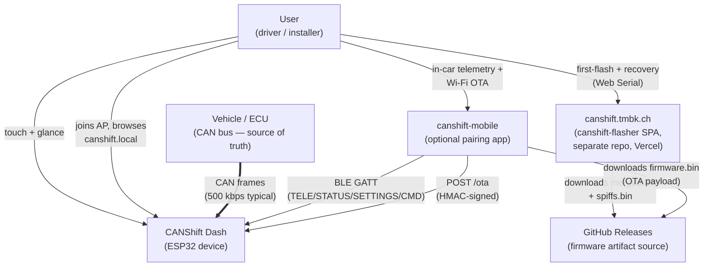
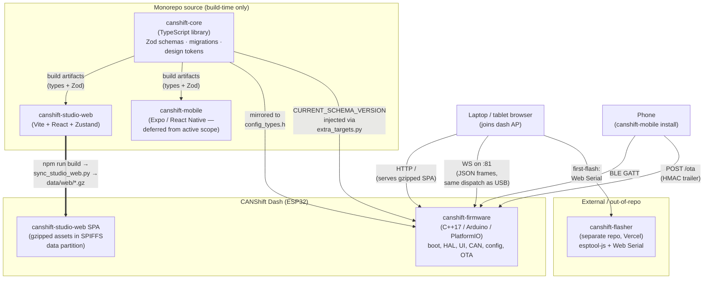
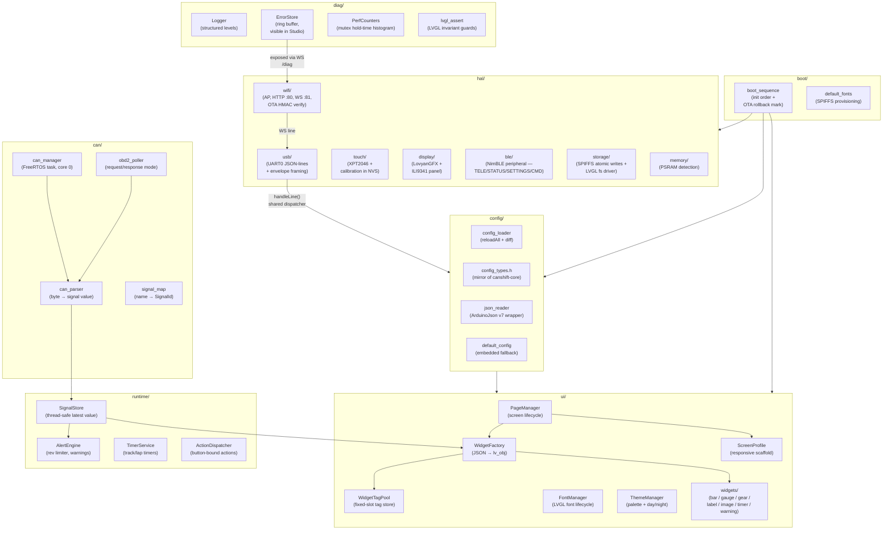
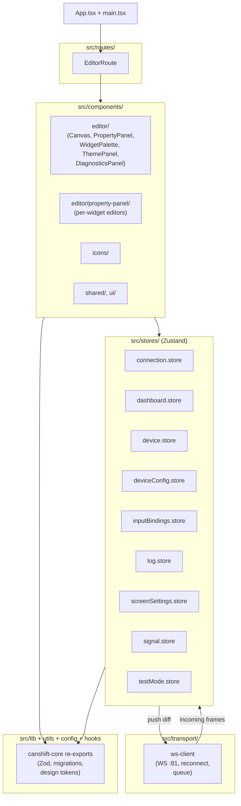
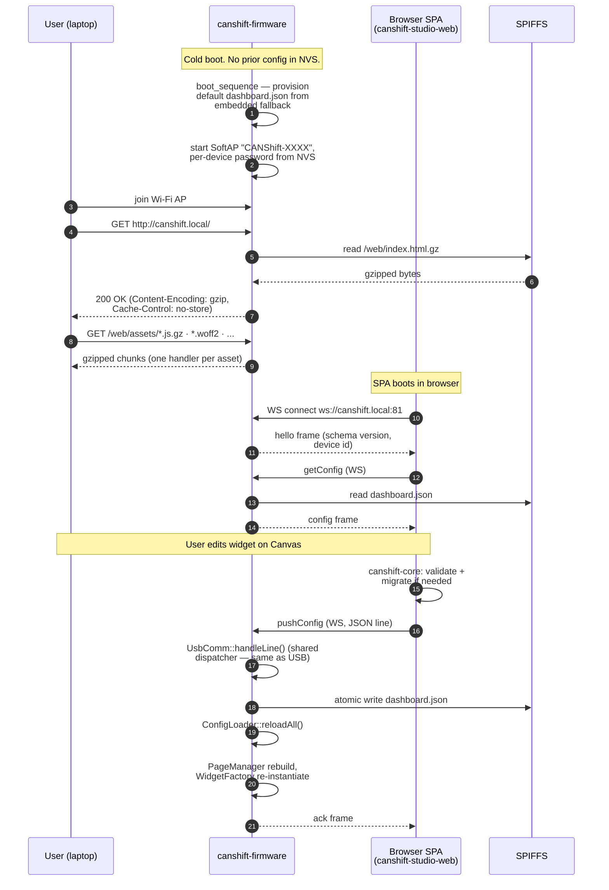
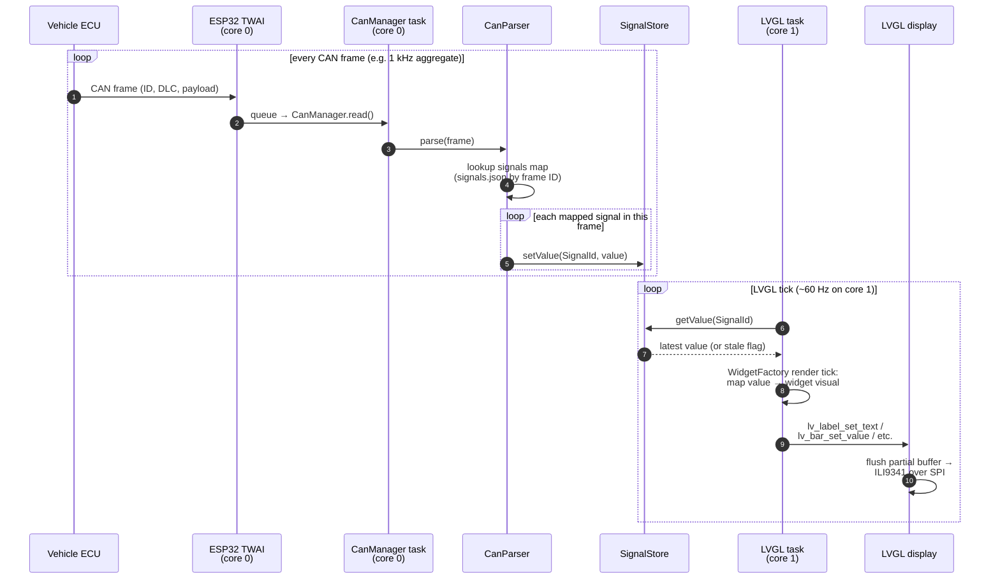

# Architecture — CANShift

C4-style architecture documentation for CANShift. Read top-to-bottom: each
level zooms one step deeper, from "what is this thing in the world" down to
"how does a CAN frame become a pixel on the screen".

> Companion docs:
> [`overall-architecture.md`](overall-architecture.md) (narrative + ASCII
> diagrams), [`config-contract.md`](config-contract.md) (schema), and
> [`RELEASE.md`](RELEASE.md) (release pipeline). This document is the
> single canonical map of how the four packages fit together.

---

## Overview

CANShift is a configurable real-time automotive dashboard that reads a
vehicle's CAN bus and renders gauges, bars, labels and warnings on a small
ESP32-driven touchscreen. The system is a monorepo of three packages:
[`canshift-core`](../canshift-core/) (TypeScript schemas + design tokens —
the single source of truth for config),
[`canshift-firmware`](../canshift-firmware/) (C++17 / Arduino / PlatformIO
ESP32 application), and [`canshift-studio-web`](../canshift-studio-web/) (a
dash-hosted React SPA that ships in the firmware SPIFFS data partition —
the canonical Studio since the Electron `canshift-studio/` package was
decommissioned post-cutover). [`canshift-mobile`](../canshift-mobile/)
(React Native, deferred from the active workstream) handles in-car BLE
telemetry and Wi-Fi OTA, and the standalone
[`canshift-flasher`](https://github.com/tburkhalterr/canshift-flasher) repo
(deployed to [canshift.tmbk.ch](https://canshift.tmbk.ch)) covers
first-flash and recovery over Web Serial.

---

## C1 — System Context

The outermost view: who and what does CANShift Dash interact with?



**Key facts at C1:**

- The vehicle's ECU is the source of truth for live signals; the dash is a
  pure consumer of the CAN bus.
- The dash is the integration hub: every other actor talks to it directly,
  none talk to each other through CANShift.
- Two install/update paths exist and are independent: the USB-Web-Serial
  flasher for first-flash + recovery, and mobile Wi-Fi OTA for in-car
  updates. The dash-hosted Studio is for configuration only — it never
  flashes firmware.
- GitHub Releases is the artifact source for both the flasher and mobile —
  see [`RELEASE.md`](RELEASE.md) for what ships per tag.

---

## C2 — Containers

One level in: which deployable units exist, and how do they talk?



**Key facts at C2:**

- `canshift-core` has zero runtime deps (Zod-only) and never ships
  to-device — it's a build-time contract. Its schemas are consumed by all
  three TypeScript packages and *mirrored* (hand-kept in sync) into
  `canshift-firmware/src/config/config_types.h`. The version is enforced
  in [`canshift-firmware/scripts/extra_targets.py`](../canshift-firmware/scripts/extra_targets.py).
- The dash-hosted SPA does NOT run on the ESP32 — the ESP32 only serves it.
  The SPA executes in the user's browser and connects back via WebSocket
  on port 81. The dispatcher behind the WS is the same `UsbComm::handleLine()`
  used for USB serial, so there is one canonical command surface.
- Post-#1123, the SPA assets live in the SPIFFS data partition, not in the
  firmware image. They ship via the per-release `spiffs.bin` artifact —
  not the OTA `firmware.bin`. (Original #1077 plan embedded them via
  `board_build.embed_files`; that was reverted when it overran the app
  partition.)
- `canshift-mobile` is currently deferred. The BLE + OTA paths are still
  validated in firmware, but the mobile half of phone-driven features
  (e.g. dash timer, #285) is out of scope until the firmware + dash-hosted
  Studio loop is stable.

---

## C3 — Components

One level deeper: what's inside each deployable container?

### canshift-firmware



**Key components in `canshift-firmware`:**

- **`boot/boot_sequence`** — strict init order; marks the OTA slot
  `ESP_OTA_IMG_VALID` after a stable boot for rollback protection.
- **`hal/wifi`** — SoftAP on `192.168.4.1`, HTTP on :80 (serves SPA assets
  from `/web/` in SPIFFS), WebSocket on :81 (JSON frame per message), and
  `POST /ota` gated by a per-device bearer token + HMAC trailer on the
  binary. See [`wifi_ap.cpp`](../canshift-firmware/src/hal/wifi/wifi_ap.cpp)
  and [`ota_hmac.h`](../canshift-firmware/src/hal/wifi/ota_hmac.h).
- **`hal/usb/usb_comm`** — single source of truth for the inbound command
  dispatcher (`handleLine`). WS and USB both feed into it; there is no
  divergent command surface.
- **`config/config_loader`** — atomic SPIFFS reads of `dashboard.json`,
  `signals.json`, `device.json`; calls `reloadAll()` after every push.
- **`can/can_manager`** — TWAI driver on core 0, dedicated FreeRTOS task.
  Pure ingest — no UI calls.
- **`can/obd2_poller`** — request/response polling for OBD-II ECUs that
  don't broadcast (#841). Reuses the same `SignalStore` sink.
- **`runtime/SignalStore`** — bounded-size thread-safe latest-value cache
  keyed by `SignalId` (a `uint8_t` from `signal_map.h`).
- **`ui/WidgetFactory`** — instantiates LVGL widgets from JSON descriptors;
  all widget per-instance state lives in
  [`WidgetTagPool`](../canshift-firmware/src/ui/widgets/widget_tag_pool.h)
  — a fixed-size shared slot pool, NOT the heap.
- **`diag/PerfCounters`** — records `g_lvglMutex` hold-time samples from
  non-UI takers so contention regressions surface in `/diag`.

### canshift-studio-web



**Key components in `canshift-studio-web`:**

- **`stores/`** — Zustand stores, one per concern. `dashboard.store` holds
  the editable config; `signal.store` holds live values; `connection.store`
  holds WS state. No store reaches across — wiring is in components.
- **`transport/ws-client`** — single WS connection to `ws://<dash>:81`.
  Handles reconnect, send queue, and JSON-per-frame parsing. Mirrors the
  firmware's `UsbComm` framing exactly so the SPA can be tested against
  USB by swapping the transport.
- **`components/editor/`** — Canvas (drag-drop widget layout), Property
  Panel (per-widget editor), Theme Panel (day/night palette), Diagnostics
  (live signals + error store from firmware).
- **`lib/canshift-core` re-exports** — Zod schemas, the migration chain,
  design tokens. The SPA validates config locally with `canshift-core`
  before pushing, so it never sends a config that the firmware would
  reject as `VER_MISMATCH`.

---

## Data Flow

Three flows worth following end-to-end. Read these alongside the C3
diagrams above.

### First-boot → AP → SPA load → push config



### Mobile OTA → HMAC verify → partition swap

```mermaid
sequenceDiagram
    autonumber
    participant M as canshift-mobile
    participant FW as canshift-firmware
    participant FLASH as ESP32 flash<br/>(app0 / app1)

    Note over M: User taps "Update firmware"
    M->>M: read ap_password from<br/>expo-secure-store /<br/>Android Keystore
    M->>M: derive ota_token =<br/>SHA-256(ap_password ||<br/>"ota-bearer-v1")[:16]
    M->>FW: BLE: trigger AP (if not already up)
    FW-->>M: AP up, IP 192.168.4.1
    M->>FW: POST /ota<br/>Authorization: Bearer <ota_token><br/>body: firmware.bin<br/>(... bytes ... || 32-byte HMAC)
    FW->>FW: hasValidBearerToken()<br/>(constant-time compare)
    alt token rejected
        FW-->>M: 401 Unauthorized
    else token accepted
        FW->>FLASH: stream body bytes →<br/>Update.write() to inactive slot
        FW->>FW: OtaHmacVerifier rolls window —<br/>last 32 bytes = trailer
        FW->>FW: HMAC_SHA256(body,<br/>OTA_HMAC_SECRET) vs trailer<br/>(constant-time)
        alt HMAC mismatch
            FW->>FLASH: abort, do not swap
            FW-->>M: 400 Bad HMAC
        else HMAC match
            FW->>FLASH: esp_ota_set_boot_partition()
            FW-->>M: 200 OK
            FW->>FW: reboot into new slot
            Note over FW: boot_sequence holds slot<br/>PENDING_VERIFY until first<br/>stable tick; rolls back on crash
        end
    end
```

### CAN frame → signal → widget pixel



---

## Key Invariants

Non-obvious truths that all four packages agree on. Violating any of these
is a bug.

1. **`canshift-core` is the sole source of truth for config schemas.**
   Both Studios validate against `canshift-core` Zod schemas before
   pushing. The firmware does NOT migrate — it logs `VER_MISMATCH` and
   reads what it can. Drift between the TypeScript schema and the C++
   `config_types.h` is a bug, not a design choice. The schema version is
   pinned via [`CURRENT_SCHEMA_VERSION`](../canshift-core/src/index.ts)
   and injected into the firmware build by
   [`extra_targets.py`](../canshift-firmware/scripts/extra_targets.py).

2. **All widget per-instance state lives in `WidgetTagPool`.** No widget
   ever calls `new` or `delete` directly. The pool has
   `CONFIG_MAX_WIDGETS_PER_PAGE` slots — exceeding that count is a
   compile-time-detectable layout error. See
   [`widget_tag_pool.h`](../canshift-firmware/src/ui/widgets/widget_tag_pool.h).

3. **LVGL mutex contract.** Any `lv_*` call from a non-LVGL-task thread
   MUST happen under `xSemaphoreTake(g_lvglMutex, …)`. Hold times are
   sampled by `PerfCounters` so contention regressions are visible in
   `/diag`. See
   [`lvgl_lock_guard.h`](../canshift-firmware/src/diag/lvgl_lock_guard.h).

4. **Wire format is snake_case JSON. In-process is camelCase.** The
   mapper sits at the transport boundary (WS receive + USB receive on
   firmware, transport layer on Studio/SPA). Code internals never see the
   wire shape; the wire never sees the internal shape.

5. **Per-device OTA bearer + shared HMAC trailer are independent.** The
   bearer token is per-device, derived from the NVS-persisted AP password
   (`SHA-256(ap_password || OTA_TOKEN_SALT)[:16]`). The trailing HMAC on
   the binary is signed with `OTA_HMAC_SECRET` — a release-line secret
   shared across devices, injected at build time. Compromising one does
   NOT compromise the other. See `wifi_ap.cpp` and `ota_hmac.cpp`.

6. **Inbound command dispatcher is shared between WS and USB.** Both
   `wifi_ws.cpp` and `usb_comm.cpp` route through `UsbComm::handleLine()`.
   New commands are added in one place; both surfaces pick them up.

7. **The SPA and the firmware version-pair atomically.** The SPA ships
   from the same monorepo at the same SHA and is rebuilt into
   `data/web/` on every firmware build (via
   [`sync_studio_web.py`](../canshift-firmware/scripts/sync_studio_web.py)).
   A user cannot run a Studio newer or older than the firmware it's
   driving.

8. **Pre-#1117 dashes cannot OTA-upgrade to post-#1117.** The SPIFFS
   partition moved from `0x310000` to `0x370000`. Field devices on the
   old layout must be USB-reflashed once via canshift.tmbk.ch to migrate.
   Documented in
   [`canshift-firmware/platformio.ini`](../canshift-firmware/platformio.ini)
   header comment.

---

## Build & Flash Architecture

A single page covering how source becomes a flashable artifact.

### PlatformIO environments

Source: [`canshift-firmware/platformio.ini`](../canshift-firmware/platformio.ini).

| Env                    | Purpose                                                |
|------------------------|--------------------------------------------------------|
| `crowpanel_28`         | Production build for the Elecrow CrowPanel 2.8" dash. The release pipeline target. |
| `crowpanel_28_wifi`    | Same hardware, Wi-Fi + WebServer linked in. Drives the dash-hosted Studio path. |
| `crowpanel_28_rust`    | Phase 3 of #827 — optional Rust-backed OTA HMAC bridge. |
| `sim`                  | On-device CAN simulator — synthesises frames so a dash on the bench shows live-looking data. |
| `debug` / `debug-perf` | Higher log level + perf-counter instrumentation enabled. |
| `secure`               | Secure-boot v2 + flash encryption first-flash flavour (see [`secure-boot-setup.md`](secure-boot-setup.md)). |
| `native`               | Host-side unit tests — no Arduino, no LVGL. Used for pure-C++ unit tests in `test/`. |

### Macro injection at build time

[`scripts/extra_targets.py`](../canshift-firmware/scripts/extra_targets.py)
runs as a PlatformIO `extra_scripts` hook on every env and injects three
build-time macros:

- `APP_VERSION_STR` — read from
  [`canshift-firmware/package.json`](../canshift-firmware/package.json)
  `version` field. The splash screen, BLE STATUS char, and `/status` HTTP
  endpoint all read this. The release pipeline asserts the literal
  appears in the linked ELF before publishing. Source-of-truth moved here
  from `canshift-studio/package.json` once the Electron Studio package was
  decommissioned post-cutover — firmware is now the only artifact in
  releases, so the version naturally tracks the firmware.
- `CONFIG_SCHEMA_VERSION` — mirrored from
  [`canshift-core/src/index.ts`](../canshift-core/src/index.ts)
  `CURRENT_SCHEMA_VERSION`. Hard-fails the build if the literal is missing.
- `OTA_HMAC_SECRET` — read from `canshift-firmware/secrets.ini`
  (gitignored). Production envs (`crowpanel_28`, `crowpanel_28_wifi`,
  `secure`) refuse to compile against the placeholder. Dev envs (env name
  contains `debug`, `sim`, or `native`) accept it with a loud warn.

### Studio SPA → SPIFFS pipeline

[`scripts/sync_studio_web.py`](../canshift-firmware/scripts/sync_studio_web.py)
is opt-in per environment via `extra_scripts` and runs before compile/link:

1. `npm run build` inside `../canshift-studio-web/` (skippable in CI via
   `CANSHIFT_SKIP_STUDIO_WEB_BUILD=1` so the workflow can install once
   and reuse).
2. Mirror every `*.gz` + every `.woff2` from `canshift-studio-web/dist/`
   into `canshift-firmware/data/web/`.
3. Validate the artifact list against an in-script manifest — fails the
   build if Vite emits an unknown chunk (otherwise the browser would 404
   silently).

The `data/` tree is what `pio run --target buildfs` packs into the
SPIFFS image (`spiffs.bin`). On first-flash via canshift.tmbk.ch, both
the merged firmware image AND the SPIFFS image are written. Subsequent
mobile OTAs update ONLY the firmware partition — SPA assets remain
whatever the last flash put there. (This is fine because the SPA's WS
protocol is versioned; a stale SPA against new firmware will surface a
schema-mismatch error frame, not silently corrupt.)

### Release artifacts

Produced by [`.github/workflows/release.yml`](../.github/workflows/release.yml)
on every merge to `main` that bumps
[`canshift-firmware/package.json`](../canshift-firmware/package.json) version:

| Artifact                                                | Use                                              |
|---------------------------------------------------------|--------------------------------------------------|
| `canshift-firmware-vX.Y.Z-crowpanel_28-merged.bin`      | First-flash via canshift.tmbk.ch (Web Serial).   |
| `canshift-firmware-vX.Y.Z-crowpanel_28-firmware.bin`    | Mobile OTA payload (`POST /ota`).                |
| `canshift-spiffs-vX.Y.Z-crowpanel_28.bin`               | SPIFFS data partition (SPA + default config).    |

See [`RELEASE.md`](RELEASE.md) for the full pipeline and validation
procedure.

---

## Future / Out of Scope

What's NOT in this architecture today but is planned. None of these is
ready for the diagram above; this section is the holding pen.

- **OBD-II v2 — multi-ECU, ISO-TP, Modes 02-09.** Current
  [`obd2_poller`](../canshift-firmware/src/can/obd2_poller.h) handles
  Mode 01 single-ECU request/response. Multi-ECU arbitration, ISO-TP
  fragmentation, freeze-frame (Mode 02), and the diagnostic modes (03-09)
  are scoped but not started.
- **Multi-board profiles (#17).** The hardware profile schema is in
  [`canshift-core/src/schemas/hardware-profile.ts`](../canshift-core/src/schemas/hardware-profile.ts);
  only the CrowPanel 2.8" profile is shipped. Additional panels (2.4",
  3.5", 4.3", 7") will land as profile entries + matching
  `lgfx_panel.h` configurations.
- **Multi-screen-size responsive layout (#18).** Scaffold landed in
  [`screen_profile.cpp`](../canshift-firmware/src/ui/screen_profile.cpp);
  current widget layouts are still 320×240-pinned. Responsive scaling +
  per-resolution widget defaults are deferred.
- **Phone-driven dash timer (#285).** Firmware side
  ([`runtime/timer_service`](../canshift-firmware/src/runtime/timer_service.cpp))
  is in place. The mobile UI that drives it is deferred along with the
  rest of `canshift-mobile`.
- **Theme editor v2 / day-night automation.** Day/night palettes ship
  today; automatic transitions tied to time-of-day or ambient light
  sensor are future work.

---

## Where to read next

- [`overall-architecture.md`](overall-architecture.md) — same territory
  but with prose narrative + ASCII diagrams; useful when you want the
  *why* alongside the *what*.
- [`config-contract.md`](config-contract.md) — the JSON contract that
  ties `canshift-core`, both Studios, and `config_types.h` together.
- [`RELEASE.md`](RELEASE.md) — release cadence, what ships, manual
  validation steps, rollback.
- [`canshift-firmware/README.md`](../canshift-firmware/README.md) — every
  on-device detail the diagrams gloss over: memory budget, partition
  table, secure-boot rollout, OTA framing.
